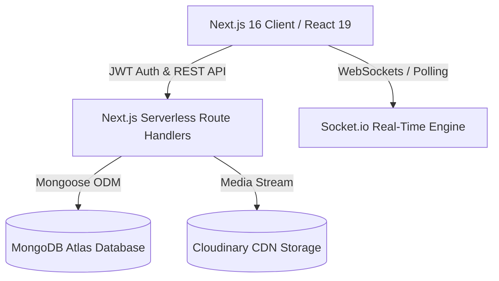

# 💬 ZiuroChat — Real-Time Chat Application

**ZiuroChat** is a modern, full-stack, real-time messaging web application built with **Next.js 16 (App Router)**, **React 19**, **MongoDB Atlas**, **Cloudinary CDN**, **Socket.io**, and **TanStack React Query**.

---

## 🌟 Key Features

- 🔐 **Simplified 1-Step Authentication**: Register instantly with Name, Email, Username, and Password (no OTP verification step required).
- 🔍 **User Search & Direct Chat**: Search any registered user by their email address or `@username` and jump straight into a direct chat.
- ⚡ **Instant Real-Time Messaging**: Messages render in **0ms** using optimistic UI updates powered by TanStack React Query and Socket.io.
- 📌 **Message Status Ticks**:
  - **Single Tick (`sent`)**: Message sent to the server.
  - **Double Grey Tick (`delivered`)**: Message delivered to the recipient.
  - **Double Green Tick (`seen`)**: Recipient opened and read the conversation.
- ⌨️ **Live Typing Indicators & Smart Sorting**:
  - Displays animated bouncing typing dots when a user starts typing.
  - Active typing conversations are automatically prioritized to the **very top of the sidebar**.
- 🗂️ **Newest Messages on Top**: Conversation list dynamically orders by the timestamp of the latest sent or received message.
- 🖼️ **Cloudinary Media Uploads**: Send images, videos, audio, and documents with instant Cloudinary CDN stream uploading.
- 👤 **Custom User Profiles**: Dedicated Profile page to update your **Avatar**, **Full Name**, **@username**, and **Bio**.
- 🌙 **Modern Design & Animations**: Responsive dark-mode interface with glassmorphism, smooth gradients, and Tailwind CSS animations.

---

## 🛠️ Tech Stack & Architecture



| Component | Technology | Description |
| :--- | :--- | :--- |
| **Frontend Framework** | **Next.js 16 (App Router)** | Server Components & Client Hooks with Turbopack |
| **UI Library & Icons** | **React 19 & Lucide Icons** | Component state management and vector icons |
| **Styling** | **Tailwind CSS & Vanilla CSS** | Glassmorphism, animations, responsive design |
| **State & Data Fetching** | **TanStack React Query v5** | Smart caching, background polling fallback & optimistic updates |
| **Database** | **MongoDB Atlas & Mongoose** | Cloud NoSQL document storage with Mongoose ODM |
| **Media Cloud** | **Cloudinary** | Image & file upload CDN streaming |
| **Real-Time Engine** | **Socket.io-client** | WebSockets with automatic reconnection & fallback |
| **Authentication** | **JWT & Bcrypt.js** | Stateless JSON Web Tokens & salted password hashing |

---

## 💾 Data Storage: Where & How Data Is Stored

### 1. MongoDB Atlas (Cloud NoSQL Database)
All structured application data (users, credentials, message history, status ticks) is stored directly in **MongoDB Atlas** cloud cluster using Mongoose schemas.

#### **User Model (`models/User.ts`)**:
```ts
{
  name: String,        // Full name
  email: String,       // Unique lowercase email address
  username: String,    // Unique lowercase @username
  password: String,    // Hashed password using bcrypt.js (salt 10)
  bio: String,         // Custom profile bio (max 200 chars)
  profilePhoto: String // Cloudinary CDN image URL
  createdAt: Date,
  updatedAt: Date
}
```

#### **Message Model (`models/Message.ts`)**:
```ts
{
  senderId: String,   // User ID of the sender
  receiverId: String, // User ID of the recipient
  text: String,       // Message text content
  mediaUrl: String,   // Cloudinary URL for image/video/file attachments
  mediaType: String,  // 'image', 'video', 'audio', 'document'
  fileName: String,   // Original filename for attachments
  fileSize: Number,   // Attachment file size in bytes
  status: String,     // 'sent' | 'delivered' | 'seen'
  createdAt: Date,
  updatedAt: Date
}
```

### 2. Cloudinary CDN (Media & Image Storage)
- Media attachments (avatars, photo uploads, attachments) are sent directly to [`app/api/media/route.ts`](file:///Users/shanikumar/Desktop/Real-Time-Chat-Apllication/next-app/app/api/media/route.ts).
- The API pipes the file buffer into **Cloudinary Upload Stream**, returning a permanent CDN HTTPS URL saved in MongoDB.

---

## ⚡ How Real-Time Messaging & WebSockets Work

1. **Socket Provider (`context/SocketContext.tsx`)**:
   - Initialized at app root with `SocketProvider`.
   - Listens for socket events: `userOnline`, `userOffline`, `typing`, `stopTyping`, and `newMessage`.
   - Automatically handles reconnection gracefully with fallback to HTTP polling.

2. **Optimistic UI & React Query Synchronization**:
   - When a user sends a message, `useSendMessage` immediately appends the message object to the local query cache (`setQueryData`).
   - The message renders on screen in **0ms** while the POST request is processed in the background.

3. **Status Tick Transitions**:
   - **`sent`**: Assigned upon creation.
   - **`delivered`**: Automatically set when saved and routed to the receiver.
   - **`seen`**: Updated in MongoDB Atlas when the recipient opens the chat or calls `useMarkMessagesRead`.

---

## 📂 Project Directory & File Structure

```
next-app/
├── app/                        # Next.js App Router root
│   ├── api/                    # Serverless API Route Handlers
│   │   ├── auth/
│   │   │   ├── login/          # POST /api/auth/login (JWT Auth & Bcrypt check)
│   │   │   └── signup/         # POST /api/auth/signup (Direct 1-step registration)
│   │   ├── media/              # POST /api/media (Cloudinary stream upload)
│   │   ├── messages/
│   │   │   ├── route.ts        # GET/POST /api/messages (Retrieve & send messages)
│   │   │   ├── conversations/  # GET /api/messages/conversations (Active chat list)
│   │   │   └── read/           # POST /api/messages/read (Mark messages as 'seen')
│   │   ├── presence/
│   │   │   └── check/          # POST /api/presence/check (Presence check)
│   │   └── users/
│   │       ├── profile/        # GET/PUT /api/users/profile (Profile bio/photo edit)
│   │       ├── search/         # GET /api/users/search (Search user by email/username)
│   │       └── [id]/           # GET /api/users/[id] (Public user profile lookup)
│   ├── chat/
│   │   └── page.tsx            # Main Chat Interface (Sidebar, Search, Messaging UI)
│   ├── login/
│   │   └── page.tsx            # Clean 1-Step Login Page
│   ├── signup/
│   │   └── page.tsx            # Clean 1-Step Signup Page
│   ├── profile/
│   │   └── page.tsx            # Profile Page (Edit photo, name, username, bio)
│   ├── globals.css             # Design system styles, glassmorphic utilities
│   ├── layout.tsx              # Root Layout wrapping Providers & Toaster
│   └── page.tsx                # Landing redirect to /login or /chat
├── context/
│   ├── AuthContext.tsx         # JWT Auth State, LocalStorage & User session manager
│   └── SocketContext.tsx       # Socket.io connection provider & event emitters
├── hooks/
│   ├── useQueries.ts           # TanStack React Query hooks (Search, Messages, Profile)
│   └── useSocket.ts            # Custom socket hooks (Typing, Presence, Notifications)
├── lib/
│   ├── mongodb.ts              # Mongoose global connection cache manager
│   └── utils.ts                # API Base normalizer & class merge utilities
├── models/
│   ├── User.ts                 # Mongoose schema for User accounts
│   └── Message.ts              # Mongoose schema for Chat Messages
├── public/                     # Static public assets
├── .env.local                  # Environment configuration secrets
├── next.config.ts              # Next.js configuration (allowedDevOrigins, Images)
├── package.json                # Dependencies & script definitions
└── tsconfig.json               # TypeScript path aliases (@/*)
```

### Breakdown of Key Components & Folders:

- **`app/chat/page.tsx`**:
  - The core chat interface. Contains the sidebar with **User Search**, **Conversations List**, **Typing Indicators**, **Status Ticks**, **Message Thread**, **Attachment Upload**, and 3-dot dropdown menus with **Log Out**.
- **`app/profile/page.tsx`**:
  - Allows users to change their profile picture via Cloudinary, edit their Full Name, update their @username, and write a custom Bio.
- **`lib/mongodb.ts`**:
  - Reuses Mongoose connections across serverless route invocations to prevent connection leaks during Next.js Hot Module Replacement (HMR).
- **`hooks/useQueries.ts`**:
  - Encapsulates all server communication using TanStack React Query hooks (`useMessages`, `useConversations`, `useSearchUsers`, `useSendMessage`).

---

## 🔑 Environment Variables Setup (`.env.local`)

Create a `.env.local` file in the root directory:

```env
# API Base Route
NEXT_PUBLIC_API_URL=/api

# JWT Secret
JWT_SECRET=ziurochat_secret_key_2026

# MongoDB Atlas Database URI
MONGODB_URI=mongodb+srv://<username>:<password>@cluster0.mongodb.net/ziurochat?retryWrites=true&w=majority

# Cloudinary Storage Configuration
CLOUDINARY_CLOUD_NAME=your_cloud_name
CLOUDINARY_API_KEY=your_api_key
CLOUDINARY_API_SECRET=your_api_secret
```

---

## 🚀 Getting Started

1. **Clone the repository**:
   ```bash
   git clone https://github.com/your-username/ziurochat.git
   cd next-app
   ```

2. **Install dependencies**:
   ```bash
   npm install
   ```

3. **Run the development server**:
   ```bash
   npm run dev
   ```

4. **Open in browser**:
   Navigate to [http://localhost:3000](http://localhost:3000).

---

## 📜 License

Distributed under the MIT License. See `LICENSE` for more information.
